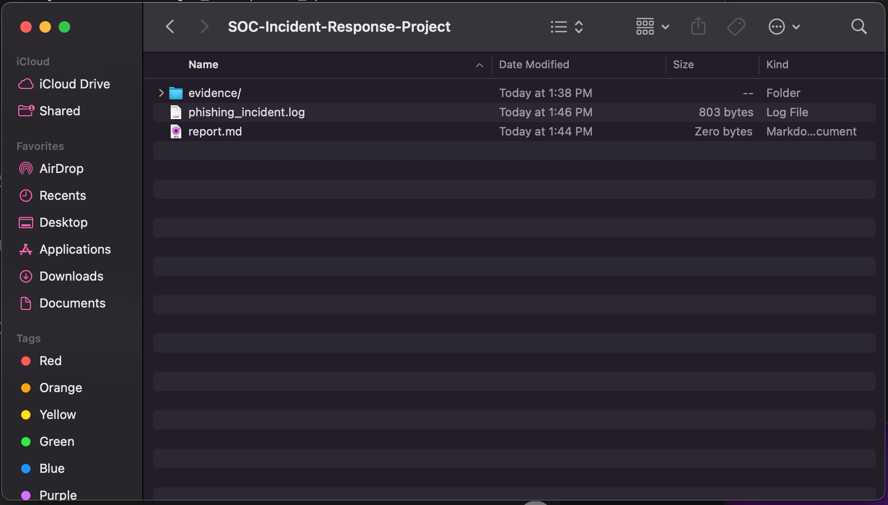
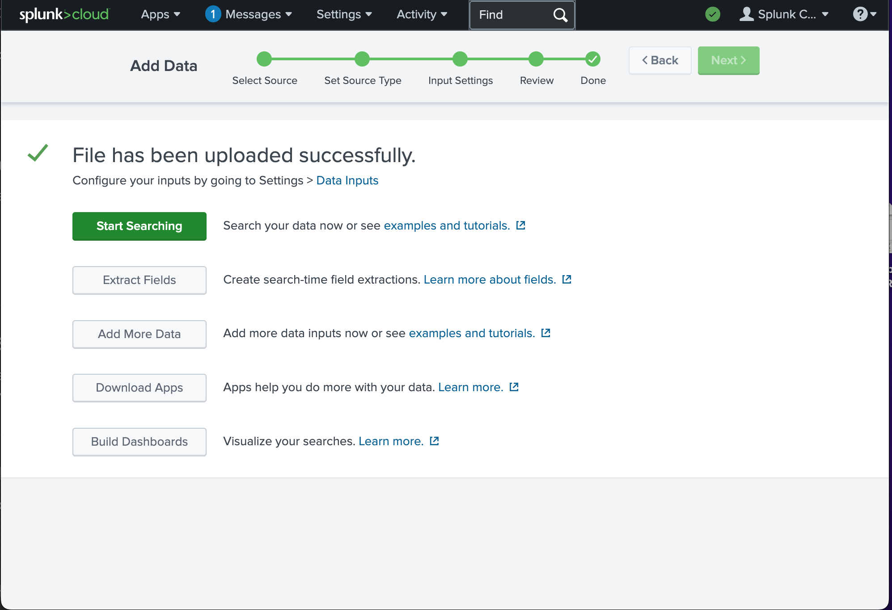
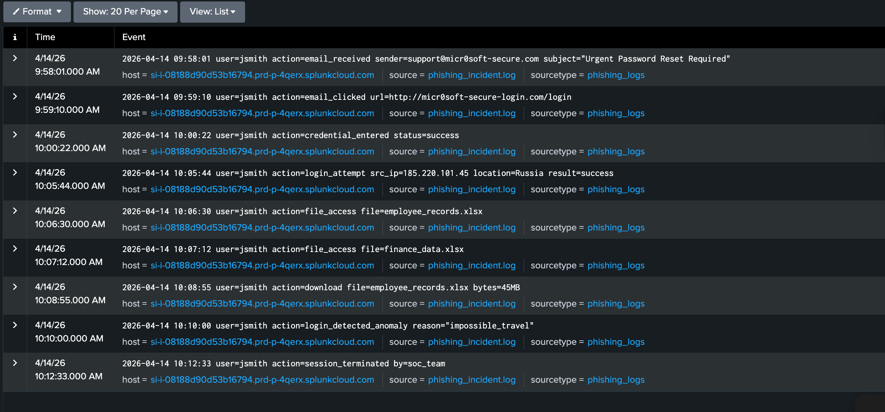
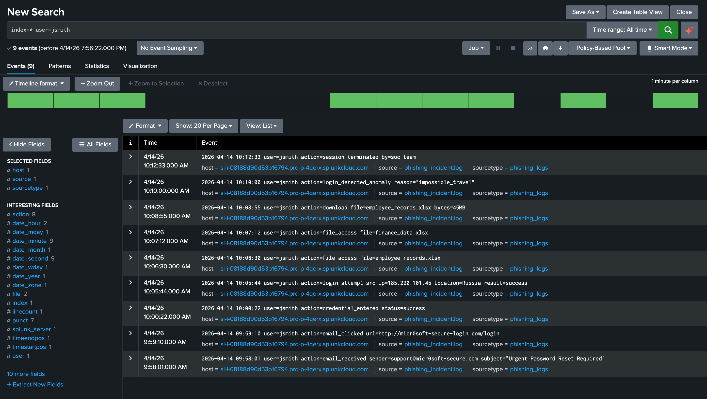
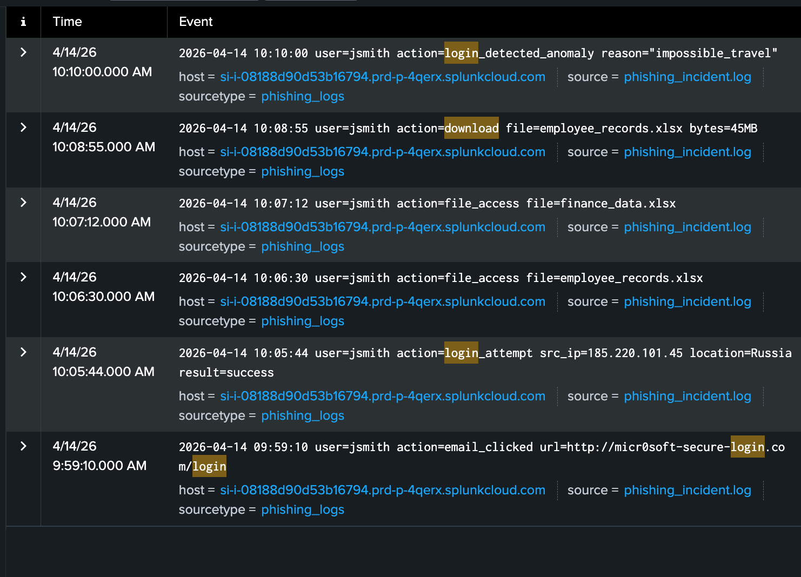
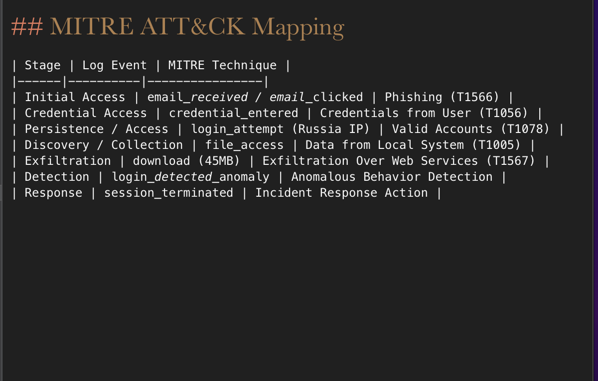
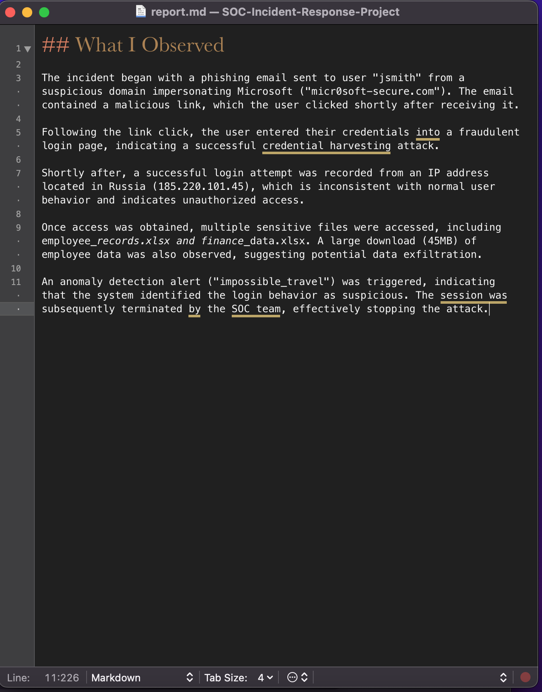
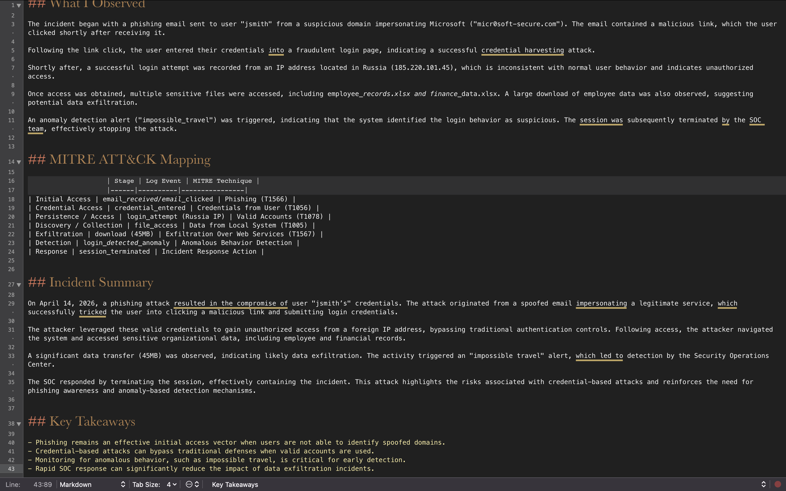

# soc-phishing-incident-response-lab
Simulated phishing incident investigation using Splunk SIEM and MITRE ATT&amp;CK mapping.

# SOC Phishing Incident Response Lab

This project simulates a real-world phishing attack investigation using Splunk SIEM and MITRE ATT&CK framework.

## 📊 Tools Used
- Splunk Cloud (SIEM)
- Log Analysis
- MITRE ATT&CK Framework

## 📁 Dataset
A simulated phishing incident log including:
- Email delivery
- Credential compromise
- Unauthorized login
- Data access and exfiltration
- SOC response

## 🔍 Investigation Workflow

### Project Structure

### Data Upload

### Search Results

### Timeline Analysis

### Suspicious Activity

### MITRE ATT&CK Mapping

### Analyst Observations

### Final Report

## 🧠 Key Skills Demonstrated
- SIEM log ingestion and analysis
- Incident timeline reconstruction
- Threat detection and investigation
- MITRE ATT&CK mapping
- Security reporting

## 📄 Full Report
See `report.md` for complete analysis.
